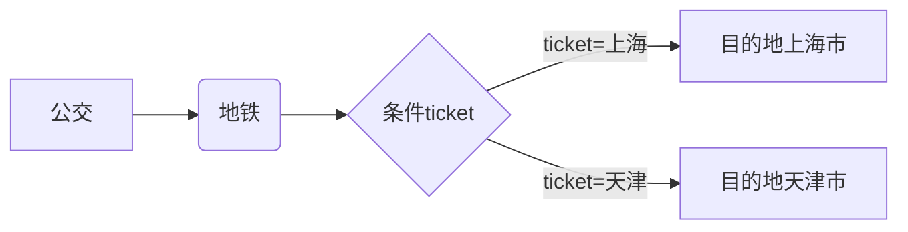
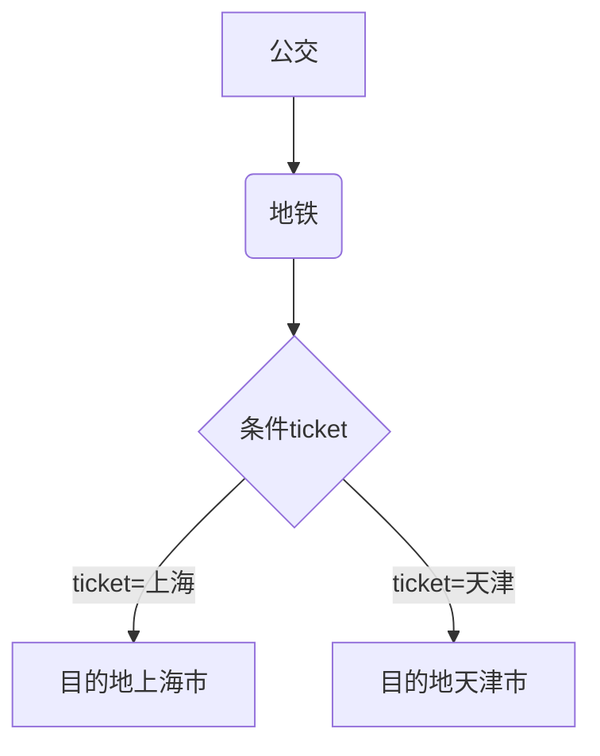

### 列表嵌套

```
主要是使用:  空格 Tab shift+Tab backspace  这三个键的使用
```


1. 天津
2. 河北
   * 保定 ( 回车后 backspace 键,然后 * 空格 ) 
   * 石家庄 ( 直接回车就可以 )
   * 邢台
3. 北京
   1. 昌平区 ( 回车后 Tab 键 )
   2. 顺义区 ( 直接回车 )
   3. 朝阳区
   4. 海淀区
      1. 中关村街道 ( 回车后 Tab 键 )
      2. 清华园街道
      3. 西三旗街道
4. 上海
   * 浦东新区 ( 回车后 backspace 键, * 空格)
   * 松江区  ( 直接回车 )
   * 青浦区
5. 河北 (回到上一级 shift + tab )
6. 山西

### 流程图

可以使用 `typora` 查看效果(兼容不好)

#### 横向流程图



#### 竖向流程图




#### 标准流程图

```flow
st=>start: 开始框
op=>operation: 处理框
cond=>condition: 判断框(是或否?)
sub1=>subroutine: 子流程
io=>inputoutput: 输入输出框
e=>end: 结束框
st->op->cond
cond(yes)->io->e
cond(no)->sub1(right)->op
```

### 标准流程图源码格式(横向)

```flow
st=>start: 开始框
op=>operation: 处理框
cond=>condition: 判断框(是或否?)
sub1=>subroutine: 子流程
io=>inputoutput: 输入输出框
e=>end: 结束框
st(right)->op(right)->cond
cond(yes)->io(bottom)->e
cond(no)->sub1(right)->op
```

